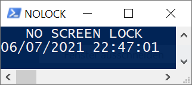

# NoLock
Low ram anti screensaver script

No more desire for the much too short period of time until the prescribed screen saver of your organization locks your pc. Here is NoLock. The memory-saving alternative to PowerPoint or a video in an endless loop. 

Howto:

1. Download
2. Run with Powershell

Whats is this window opening as i run NoLock?

It's a little control window that tells you when it last made sure your screen saver didn't turn on.
